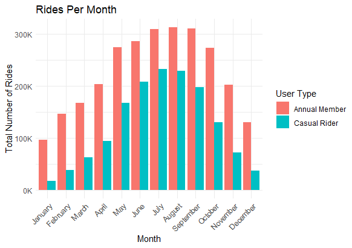

**<u>CYCLISTIC BIKE-SHARE ANALYSIS REPORT</u>**

**1. Introduction**

Cyclistic is a bike-share company in Chicago with a growing fleet of
bicycles and an extensive network of docking stations. The company
offers flexible pricing plans, including single-ride passes, full-day
passes, and annual memberships.

The goal of this analysis is to understand how casual riders and annual
members use Cyclistic bikes differently. Insights from this study will
help the marketing team convert casual riders into annual members,
increasing customer retention and profitability.

**2. Business Task**

The primary business question to address:

How do annual members and casual riders use Cyclistic bikes differently?

The insights derived will support Cyclistic’s marketing strategy to
maximise the number of annual memberships.

**3. Data Sources & Preparation**

<u>Data Description</u>

- The dataset consists of 12 months of ride data from September 2023 –
  August 2024.

- Data was obtained from Divvy (Motivate International Inc.), which
  manages Chicago’s public bike-share system.

- It includes ride start and end times, ride duration, bike type, and
  user type (casual vs. member).

- Privacy compliance: No personally identifiable information is included
  in the dataset

<u>Data Cleaning & Processing</u>

To prepare the dataset for analysis:

- Merged 12 months of ride data into a single dataset.

- Removed empty rows and columns to ensure clean data.

- Converted date/time columns to appropriate formats.

- Filtered out rides with negative or zero duration.

- Created new variables namely:

<!-- -->

- ride_duration (minutes)

- day_of_week, month_of_year (for trend analysis)

- start_hour, end_hour (for hourly distribution)

**4. Data Analysis & Insights**

<u>4.1 Rides Per Day of the Week</u>

Key Findings:

- Annual members ride more frequently on weekdays, suggesting they use
  bikes primarily for commuting.

- Casual riders take more trips on weekends, indicating leisure-based
  usage.

Visualization:

<u>4.2 Ride Duration Comparison</u>

Key Findings:

- Casual riders have significantly longer ride durations compared to
  annual members.

- Members tend to use bikes for short, consistent rides throughout the
  week.

Visualization:

<u>4.3 Hourly Ride Trends</u>

Key Findings:

Peak ride hours differ:

- Members peak at around 7 AM in morning and around 5 PM in the evening

- Casual riders peak at around 5 PM in the evening

> Members tend to ride in the morning and evening, indicating they
> primarily use the service for commuting, while casual riders prefer
> riding later in the day, suggesting they use it mainly for leisure.

Visualization:

<u>4.4 Monthly Usage Trends</u>

Key Findings:

- Both members and casual riders are more active in summer months (May –
  September), but the number of rides for casual riders is a lot less in
  winter months as compared to members.

- Weather may influence casual riders more than members.

Visualization:

**5. Key Takeaways & Recommendations**

<u>Key Findings</u>

- Members primarily use bikes for commuting, as indicated by peak usage
  during weekday mornings and evenings. Their ride durations are
  relatively short and consistent throughout the week, reflecting
  regular travel patterns.

- Casual riders mostly use bikes for leisure, with increased activity on
  weekends and longer ride durations. This suggests that they ride for
  recreation or sightseeing rather than daily transportation.

- Seasonal trends reveal higher casual rider activity in the summer,
  likely due to favourable weather conditions and increased outdoor
  recreational opportunities. In contrast, member usage remains more
  stable across seasons, this shows that members continue using
  bike-sharing for commuting regardless of the season.

<u>Marketing Recommendations</u>

**1. Promote Annual Membership Discounts During Peak Casual Months**

- Offer summer discounts or limited-time membership trials to casual
  riders.

**2. Incentivize Weekday Rides for Casual Riders**

- Introduce weekday ride discounts for casual riders to build commuting
  habits.

**3. Introduce a Weekend Package to Attract More Subscriptions**

- Offer a special weekend pass or discounted weekend membership for
  casual riders.

- Highlight benefits such as unlimited rides on Saturdays and Sundays to
  encourage more frequent usage.

- This can be used as a gateway to promote full memberships by
  showcasing cost savings and added perks.

**6. Conclusion**

This analysis provides actionable insights into Cyclistic’s user
behaviour. By targeting casual riders with strategic marketing
campaigns, the company can increase annual membership conversions,
boosting long-term revenue.

Next Steps:

- A/B test promotional campaigns for casual users.

- Analyse data for specific station-level trends.

- Implement targeted email & in-app marketing strategies.

**7. Appendix**

[Full R
Code](C://Users/Aaqib/OneDrive/Documents/COURSE%20MATERIALS/Capstone%20Project%20-%20Cyclistic/Cyclistic-Bike-Share.html)

[Raw Data Sample](https://divvy-tripdata.s3.amazonaws.com/index.html)
